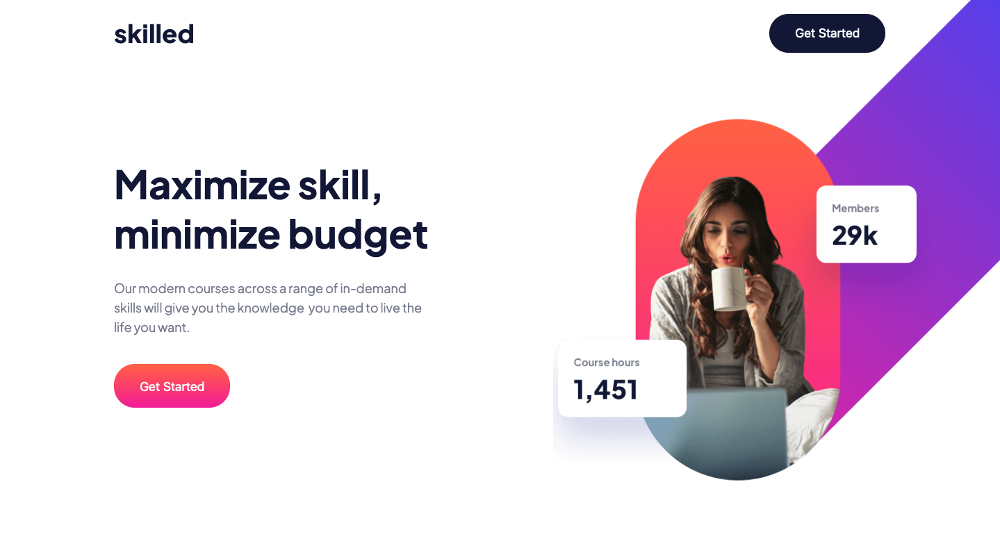

# 💻 Frontend Mentor - Skilled e-learning landing page solution

This is a solution to the [Skilled e-learning landing page challenge on Frontend Mentor](https://www.frontendmentor.io/challenges/skilled-elearning-landing-page-S1ObDrZ8q). Frontend Mentor challenges help you improve your coding skills by building realistic projects.

## Table of contents

- [💻 Frontend Mentor - Skilled e-learning landing page solution](#-frontend-mentor---skilled-e-learning-landing-page-solution)
  - [Table of contents](#table-of-contents)
  - [Overview](#overview)
    - [The challenge](#the-challenge)
    - [Screenshots](#screenshots)
      - [Mobile view](#mobile-view)
      - [Tablet view](#tablet-view)
      - [Desktop view](#desktop-view)
    - [Links](#links)
  - [My process](#my-process)
    - [Built with](#built-with)
    - [What I learned](#what-i-learned)
    - [Useful resources](#useful-resources)
  - [Author](#author)

---

## Overview

### The challenge

Users should be able to:

- View the optimal layout depending on their device's screen size
- See hover states for interactive elements

### Screenshots

#### Mobile view

#### Tablet view

#### Desktop view

### Links

- Solution URL: [Github Code](https://github.com/VLOrozco/skilled-elearning-landing-page.git)
- Live Site URL: [Skilled eLearning Landing Page](https://vlorozco.github.io/skilled-elearning-landing-page/)

---

## My process
### Built with

- Semantic HTML5 markup
- CSS custom properties
- Flexbox
- CSS Grid
- Mobile-first workflow

1. Review all materials provided by [Skilled e-learning landing page challenge on Frontend Mentor](https://www.frontendmentor.io/challenges/skilled-elearning-landing-page-S1ObDrZ8q).

2. Create plan design outline, beginning with mobile view and including main and sub sections with important `
` needed for the webpage.
   * Establish any need for flexbox or grid layout properties.

3. Keep it simple and build webpage layout.
   * globals
   * navbar
   * header
   * pop-courses
   * footer

4. Then focus on each main section separately, beginning from the top to the bottom of the page.
   * type content in html doc
   * design output with css styles
   * compare page with model design styles provided

5. Make adjustments to any bugs that occur and research css properties and values as needed.

6. Build out media queries to adjust to each view size.
   * tablet view
   * desktop view
     * create hover and active states for buttons

7. Review code for repeat code and condense code, as needed.

8. Finally compare responsive website with models one last time.

9. Since I am still new to the world of coding, after all these steps I needed to learn how to create a README.md file and all about markdown through Codecademy, so that I could complete and submit this challenge. There is a lot to learn and explore. I am excited to utilize more from my discoveries & learning.

### What I learned

1. How to write a README.md file and information to find the markdown guide resource.

2. The importance and execution of developing an organized process to creating a solution prior to attempting to execute writing coding in the VSCode editor (IDE).

3. Utilizing `<picture>` and `<src>` tags to create responsive images.

4. Using `` tag for linking svg files/images to html, creating a cleaner look and much easier to scan document || edit image size.

5. Version control is extremely important, next time begin & end the project consistently utilizing git or Github Desktop for making commits and version control. I did not utilize this throughout this project and will not make that mistake again!

### Useful resources

- [W3schools](https://www.w3schools.com/css/default.asp)
- [mdn docs](https://developer.mozilla.org/en-US/docs/Web/CSS) 

*Both of these documents have been beneficial to my growth in understanding and executing my code, along with all my learning through Codecademy and research on the web and YouTube. There are other articles that I explored and will include them in my future resources as I continue to code.*

---

## Author
- Github - [Veronica L. Orozco](https://github.com/VLOrozco)
- Frontend Mentor - [@VLOrozco](https://www.frontendmentor.io/profile/VLOrozco)
- Codecademy - [orozcov3](https://www.codecademy.com/profiles/orozcoV3)
